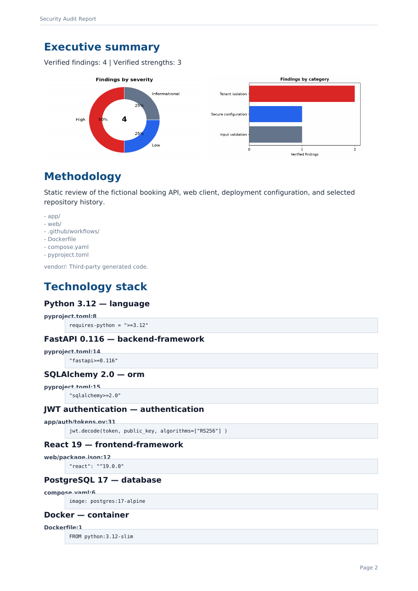

# Verified Code Security Audit

[Português (Brasil)](README.pt-BR.md)

<p align="center">
  <a href="https://github.com/joldmarfilho/verified-code-security-audit/actions/workflows/tests.yml"></a>
  
  
  
  
  
  
  
  
  <a href="LICENSE"></a>
</p>

An evidence-first Agent Skill and Python toolkit for reviewing source-code
security without inventing findings. It records exactly what was inspected,
separates exhaustive review from sampling, preserves positive controls, and
generates reproducible English or Brazilian Portuguese reports from validated
JSON.



## What it produces

The audit workflow has one canonical input and two generated outputs per locale:

- `audit-report.en.json` or `audit-report.pt-BR.json` — portable, non-executable data;
- `security-audit-report.en.pdf` or `security-audit-report.pt-BR.pdf` — A4 report;
- `github-issues.en.md` or `github-issues.pt-BR.md` — copy-ready actionable issues.

See the fully fictional [English Acme Booking example](examples/synthetic/audit-report.en.json)
or its [pt-BR equivalent](examples/synthetic/audit-report.pt-BR.json).

## Install the Agent Skill

Clone the repository into your agent's skill directory, then start a new session
so the skill is discovered.

Codex:

```bash
mkdir -p ~/.agents/skills
git clone https://github.com/joldmarfilho/verified-code-security-audit.git ~/.agents/skills/verified-code-security-audit
```

Claude Code:

```bash
mkdir -p ~/.claude/skills
git clone https://github.com/joldmarfilho/verified-code-security-audit.git ~/.claude/skills/verified-code-security-audit
```

Invoke it explicitly:

```text
Use $verified-code-security-audit to audit this repository and generate a verified security report.
```

The skill calls `vcsa` to validate and render its deliverables, so install the
Python tools below before running an audit.

The standalone prompts are also available in
[`prompts/audit.en.md`](prompts/audit.en.md) and
[`prompts/audit.pt-BR.md`](prompts/audit.pt-BR.md).

## Install the Python tools in a virtual environment

Do not install dependencies globally. From the cloned repository, create an
isolated virtual environment:

```bash
python -m venv .venv
```

Activate it on Linux or macOS:

```bash
source .venv/bin/activate
```

Or on Windows PowerShell:

```powershell
.\.venv\Scripts\Activate.ps1
```

Install the renderer:

```bash
python -m pip install .
```

## Quick start

Create a UTF-8 audit record that follows
[`schema/audit-report.schema.json`](schema/audit-report.schema.json). Validate it
before generating presentation files:

```bash
vcsa validate audit-report.en.json
vcsa render audit-report.en.json --locale en --output docs/security-audit
```

For Brazilian Portuguese:

```bash
vcsa validate audit-report.pt-BR.json
vcsa render audit-report.pt-BR.json --locale pt-BR --output docs/security-audit
```

`metadata.content_locale` must match `--locale`. Correct the JSON and rerun both
commands instead of hand-editing a PDF or Markdown output.

## Why evidence-first

Every finding requires a repository-relative path, exact lines, a minimal snippet,
preconditions, exploit path, impact, severity, confidence, remediation, and
acceptance criteria. Verified strengths use the same evidence standard.

Coverage claims are checked, not merely declared. `exhaustive` requires a known
`discovered` count equal to `reviewed`, `not-applicable` requires `reviewed` of
zero, and partial review must be recorded as `sampled` or `limited`.

Repository content is untrusted. The skill defaults to read-only analysis and
requires explicit authorization before dynamic execution, dependency installation,
network access, or mutation. Secret values are replaced with `[REDACTED]`, and
validation rejects recognizable raw credentials in any field of the record — not
only in evidence snippets.

## Boundaries and limitations

This project standardizes static review evidence and report generation. It does
not certify software, prove the absence of vulnerabilities, replace penetration
testing, or infer controls that are not visible in scope. Reports must state dirty
worktree status, exclusions, inaccessible history, unreviewed services, and any
other limitations.

## Development

Install test dependencies in the virtual environment and run the complete suite:

```bash
python -m pip install -e ".[dev]"
python -m unittest discover -s tests -v
python /path/to/skill-creator/scripts/quick_validate.py .
```

The final command is available when Codex's bundled `skill-creator` is installed.
CI tests Python 3.10, 3.11, and 3.12 and renders both synthetic locales.

## Reporting a security issue

Do not post real credentials, private keys, customer data, or exploit details in a
public issue. Prefer GitHub's private vulnerability reporting for this repository;
if it is unavailable, contact the maintainer privately and include only redacted,
minimal reproduction details.

## Support this project

If this project helps your security-review workflow, you can support its
continued development:

<a href="https://www.buymeacoffee.com/joldmarxxtz"></a>

## License

Released under the [MIT License](LICENSE).
