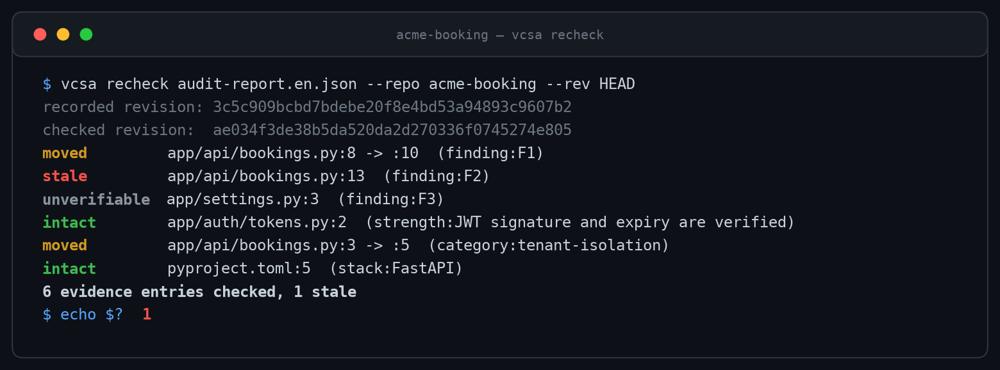

# Verified Code Security Audit

[English](README.md)

<p align="center">
  <a href="https://github.com/joldmarfilho/verified-code-security-audit/actions/workflows/tests.yml"></a>
  
  
  
  
  
  
  
  
  
  <a href="https://github.com/obra/superpowers"></a>
  
  <a href="LICENSE"></a>
</p>

Uma Agent Skill e um conjunto de ferramentas Python orientados por evidências
para revisar a segurança de código-fonte sem inventar achados. O projeto registra
exatamente o que foi inspecionado, separa revisão exaustiva de amostragem, preserva
controles positivos e gera relatórios reproduzíveis em inglês ou português do
Brasil a partir de JSON validado.


## O que é gerado

O fluxo tem uma entrada canônica e duas saídas geradas por locale:

- `audit-report.en.json` ou `audit-report.pt-BR.json` — dados portáveis e não executáveis;
- `security-audit-report.en.pdf` ou `security-audit-report.pt-BR.pdf` — relatório A4;
- `github-issues.en.md` ou `github-issues.pt-BR.md` — issues acionáveis prontas para copiar.

Consulte o exemplo totalmente fictício [Acme Booking em PT-BR](examples/synthetic/audit-report.pt-BR.json)
ou sua [versão em inglês](examples/synthetic/audit-report.en.json).

## Instalar a Agent Skill

Clone o repositório no diretório de skills do seu agente e inicie uma nova sessão
para que a skill seja descoberta.

Codex:

```bash
mkdir -p ~/.agents/skills
git clone https://github.com/joldmarfilho/verified-code-security-audit.git ~/.agents/skills/verified-code-security-audit
```

Claude Code:

```bash
mkdir -p ~/.claude/skills
git clone https://github.com/joldmarfilho/verified-code-security-audit.git ~/.claude/skills/verified-code-security-audit
```

Antigravity:

```bash
mkdir -p .agents/skills
git clone https://github.com/joldmarfilho/verified-code-security-audit.git .agents/skills/verified-code-security-audit
```

Use a skill explicitamente:

```text
Use $verified-code-security-audit para auditar este repositório e gerar um relatório de segurança verificado.
```

### Disciplina operacional e Superpowers

Esta skill está alinhada aos padrões de rigor e disciplina operacional do [Superpowers](https://github.com/obra/superpowers):
- **Rastreamento de tarefas (`using-superpowers`):** O agente mantém um checklist ativo de tarefas para todas as 5 fases da auditoria.
- **Investigação sistemática (`systematic-debugging`):** Cada vulnerabilidade deve ser fundamentada em um caminho de exploração comprovado de ponta a ponta, e não em suposições superficiais.
- **Verificação pré-conclusão (`verification-before-completion`):** A execução só é finalizada após a validação e renderização bem-sucedidas via `vcsa validate` e `vcsa render`.

A skill chama `vcsa` para validar e renderizar os artefatos, então instale as
ferramentas Python abaixo antes de executar uma auditoria.

Os prompts standalone também estão em
[`prompts/audit.en.md`](prompts/audit.en.md) e
[`prompts/audit.pt-BR.md`](prompts/audit.pt-BR.md).

## Instalar as ferramentas Python em ambiente virtual

Não instale dependências globalmente. Dentro do repositório clonado, crie um
ambiente virtual isolado:

```bash
python -m venv .venv
```

Ative no Linux ou macOS:

```bash
source .venv/bin/activate
```

Ou no Windows PowerShell:

```powershell
.\.venv\Scripts\Activate.ps1
```

Instale o renderizador:

```bash
python -m pip install .
```

## Início rápido

Crie um registro UTF-8 conforme
[`schema/audit-report.schema.json`](schema/audit-report.schema.json). Valide antes
de gerar os arquivos de apresentação:

```bash
vcsa validate audit-report.pt-BR.json
vcsa render audit-report.pt-BR.json --locale pt-BR --output docs/security-audit
```

Para inglês:

```bash
vcsa validate audit-report.en.json
vcsa render audit-report.en.json --locale en --output docs/security-audit
```

`metadata.content_locale` deve coincidir com `--locale`. Corrija o JSON e execute
novamente os dois comandos em vez de editar PDF ou Markdown manualmente.

## Um relatório expira

A evidência está presa à revisão em que foi produzida: `metadata.revision`,
`branch` e `worktree_dirty` são campos obrigatórios, e a revisão é impressa no
relatório. Quando o código anda, um caminho e uma linha registrados podem apontar
para outra coisa.

`vcsa recheck` compara cada trecho registrado com uma revisão e o classifica:

```bash
vcsa recheck audit-report.pt-BR.json --repo . --rev HEAD
```



- `intact` — o trecho continua na linha registrada;
- `moved` — o trecho continua presente em outra linha, e o achado permanece válido;
- `stale` — o trecho ou o arquivo desapareceu, e o achado precisa ser reavaliado;
- `unverifiable` — o trecho foi redigido e não pode ser comparado.

O comando termina com código `1` quando alguma evidência está `stale`, o que
permite usá-lo como gate de CI que expira o relatório quando o código auditado
muda por baixo dele. A comparação ignora indentação, então uma reformatação
sozinha normalmente não invalida a evidência; ainda assim, `recheck` não revalida o
raciocínio — um trecho que sobreviveu não prova que o caminho de exploração
sobreviveu.

## Por que priorizar evidências

Todo achado exige caminho relativo ao repositório, linhas exatas, trecho mínimo,
pré-condições, caminho de exploração, impacto, severidade, confiança, correção e
critérios de aceite. Strengths verificados seguem o mesmo padrão de prova.

Declarações de coverage são verificadas, não apenas declaradas. `exhaustive` exige
`discovered` conhecido e igual a `reviewed`, `not-applicable` exige `reviewed` zero,
e revisão parcial precisa ser registrada como `sampled` ou `limited`.

O conteúdo do repositório é não confiável. A skill usa análise somente leitura por
padrão e exige autorização explícita antes de execução dinâmica, instalação de
dependências, acesso à rede ou alterações. Segredos são substituídos por
`[REDACTED]`, e a validação rejeita credenciais brutas reconhecíveis em qualquer
campo do registro — não apenas nos trechos de evidência.

## Limites e limitações

Este projeto padroniza evidências de revisão estática e geração de relatórios. Ele
não certifica software, não prova ausência de vulnerabilidades, não substitui
testes de intrusão e não presume controles invisíveis no escopo. O relatório deve
declarar worktree sujo, exclusões, histórico inacessível, serviços não revisados e
outras limitações.

## Desenvolvimento

Instale dependências de teste no ambiente virtual e execute a suíte completa:

```bash
python -m pip install -e ".[dev]"
python -m unittest discover -s tests -v
python /caminho/para/skill-creator/scripts/quick_validate.py .
```

O último comando fica disponível quando o `skill-creator` incluído no Codex está
instalado. O CI testa Python 3.10, 3.11, 3.12 e 3.13 e renderiza os dois locales sintéticos.

## Relatar uma falha de segurança

Não publique credenciais reais, chaves privadas, dados de clientes nem detalhes de
exploração em uma issue pública. Prefira o relato privado de vulnerabilidade do
GitHub neste repositório; se ele não estiver disponível, fale com o mantenedor em
canal privado e envie apenas detalhes mínimos e anonimizados.

## Apoie o projeto

Se este projeto ajuda seu fluxo de revisão de segurança, você pode apoiar a
continuidade do desenvolvimento:

<a href="https://www.buymeacoffee.com/joldmarxxtz"></a>

## Agradecimentos e Créditos

O prompt original de auditoria de segurança e seus conceitos centrais foram criados por [@deyvin](https://github.com/deyvin). Este projeto expande essa base introduzindo validação formal por JSON Schema, renderização determinística de PDF/Markdown bilíngue com a CLI `vcsa` e diretrizes de disciplina operacional do [Superpowers](https://github.com/obra/superpowers).

## Licença

Distribuído sob a [licença MIT](LICENSE).
